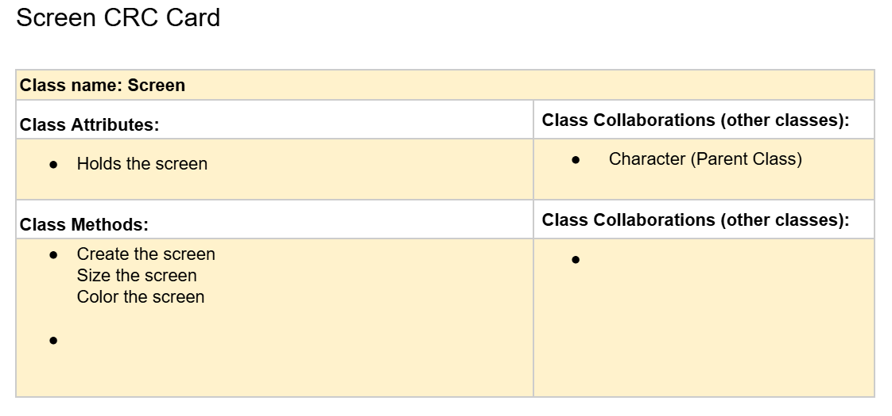

# CSC226 Final Project

## Instructions

**Author(s)**: Lindsay Manabat and Julius Fritz

️**Google Doc Link**: https://docs.google.com/document/d/1ZJxvK9T8e1s6n0YdTw4ysDT0Wz4_HKCg75EftcwxkJg/edit?usp=sharing

---

## Milestone 1: Setup, Planning, Design

️**Title**: `Blackjack`

**Purpose**: `The orginal idea of blackjack but with a twist of having a special card.`

**Source Assignment(s)**: ` Homework on "The Game of Nim. Teamwork on 'Intro to Classes, The Legend of Tuna"`

️**CRC Card(s)**:
 in place of this one. ")





**Branches**: This project will **require** effective use of git.
```
    Branch 1 starting name: manabatl3
    Branch 2 starting name: fritzj2
```

### References

- https://www.247blackjack.com/
- https://www.piskelapp.com/ (We used this to create the images)
- https://www.pygame.org/docs/
- https://docs.python.org/3/library/unittest.html
- https://www.youtube.com/watch?v=G8MYGDf_9ho (For learning how to add buttons to the screen)
- https://www.pygame.org/wiki/Spritesheet
- 

---

## Milestone 2: Code Setup and Issue Queue
```
    We think the pace we're working seems good. We're worried that it'll eventually catch up on us and working on the screen with pygame. 
    We've been cordinating pretty well and hope to continue. We're getting the hang of using/writing issue queue. Get better on using the feedback 
    we got from David and implement it onto the next work session. Use the LAB TA hours for better understanding on how to approach what we want to do.
```

---

## Milestone 3: Virtual Check-In

**Completion Percentage**: `65-70%`

```
    We're confident about completing this project in time because we know how much we still need to do and setting aside time to work on them.
    We worked on the framework of the upcoming steps which allows us to break it down easier and faster. We've chipped away from the really hard and complicated steps
    so we feel more confident in whats left. Instead of working on it individually so much we're working on it together at the same time, making it easier to add our own opinions, ideas, features, and debugging.
    
```

---

## Milestone 4: Final Code, Presentation, Demo

### User Instructions

```
    How to play Blackjack, 1st you start with betting. Then your goal is to get as close as possible to 21 while beating the dealer. You use the hit 
    button to draw a new card and the stand button to pass the turn to the dealer. There are 4 types of special cards which change the amount of money you bet and the
    amount of money you have. Afterwards you compare the values of each hand to see which are the closest to 21. Then press space to play again.
```

### Errors and Constraints

```
    The held button bug with the spacebar and holding stand which smashes through different rounds really quickly. 
    This could be fixed by removing the ability to hold two buttons at the same time.
    
```

### ❗Reflection

❗Each partner should write three to four well-written paragraphs address the following (at a minimum):
- Why did you select the project that you did?
- How closely did your final project reflect your initial design?
- What did you learn from this process?
- What was the hardest part of the final project?
- What would you do differently next time, knowing what you know now?
- How well did you work with your partner? What made it go well? What made it challenging?

```
    ...
```

```
    Partner 2: **Replace this with your reflection
```

---